# EvoShift

> Verified test-time self-evolution for API-only LLM agents under distribution
> shift.

EvoShift is a research-oriented Python framework for agents that improve from
environment feedback without fine-tuning model weights or requiring a GPU. Its
core algorithm, **VERA** (Verified Experience Replay and Adaptation), evolves
versioned procedural memory and a bounded retrieval policy while keeping the
base LLM frozen.

The project is designed for reproducible Agent/LLM-algorithm experiments, not
as a claim of state-of-the-art performance. Its emphasis is on non-stationary
evaluation, falsifiable promotion decisions, rollback, cost accounting, and an
immutable held-out audit path.

## Core pipeline

```mermaid
flowchart LR
    X["Task stream x_t"] --> R["Retrieve active memories"]
    R --> S["Frozen LLM solver"]
    S --> Y["Score before feedback"]
    Y --> T["Dynamic source/context trust"]
    T --> D["Page-Hinkley + novelty drift"]
    Y --> C["Failure attribution"]
    C --> M["Shadow experience card"]
    M --> V["Paired champion/challenger replay"]
    D --> P["Allowlisted policy patch"]
    P --> V
    V --> G{"Quality, CI, regression, cost gates"}
    G -->|pass| Q["Probationary memory"]
    G -->|fail| J["Reject"]
    Q --> F["Later memory-on/off future audit"]
    F -->|confirm| A["Activate + supersede conflicts"]
    F -->|harm| J
    A --> U["Online utility + rollback"]
    A --> K["Trusted-failure exact-version audit"]
    K -->|causal harm| Z["Retire + verified reacquisition"]
```



VERA has two time scales:

- The fast loop turns eligible failures into typed experience cards, stages
  them in shadow state, deploys replay-passing cards in probation, and confirms
  or rolls them back from later paired counterfactuals.
- The slow loop detects sustained reward/retrieval shift and proposes a typed
  patch over allowlisted retrieval and write hyperparameters.

No model-generated Python is executed. Every episode, memory version, policy,
validation decision, event, and rollback is persisted with provenance.

## What is implemented

- OpenAI-compatible `/responses` client with bounded retries, `Retry-After`,
  stable idempotency keys, caching, budgets, usage/cost normalization, and
  secret redaction.
- Deterministic fake/demo providers for offline tests and full pipeline demos.
- Pinned BIG-Bench Hard adapter with fixed Git revision, SHA-256, byte-size,
  manifest, and canary validation.
- Generic Hugging Face and JSONL adapters plus a deterministic distribution
  shift benchmark.
- Provenance-domain-scoped BM25 retrieval with Beta posterior utility,
  UCB-style exploration, MMR diversity, token budgeting, versioning,
  deduplication, and rollback.
- Dynamic same-source feedback trust using a Beta source posterior plus
  per-context committed/pending labels, with no hidden-oracle online access.
- Per-domain post-alarm-reset drift detectors, candidate evidence scheduling,
  current-regime ordinary replay, and cross-regime protected replay.
- Lane-isolated low-trust shadow hypotheses with an explicit recurrence
  likelihood-ratio e-process; trusted evidence keeps an independent fast path.
- Probationary memory, later memory-on/off counterfactual audit, asymmetric
  harm stopping, stream-end expiration, and explicit realized-audit coverage.
- Conflict-aware supersession with predecessor reactivation after legacy
  posterior rollback; causal retirement instead requires verified
  reacquisition because the predecessor may also be stale.
- Continuous active-memory governance with budgeted exact-version
  leave-one-out controls, persisted learner-visible causal ledgers, selective
  retirement, and replay/probation-based recurring-rule reacquisition.
- Paired bootstrap promotion gates with protected-slice and resource checks.
- Immutable run artifacts, SQLite audit state, sweeps, paired run comparison,
  and Markdown/JSON reports.
- Frozen held-out audit that enforces the same model, rejects source-stream
  reuse, disables all adaptation, and proves state immutability with SHA-256.

The Static, Self-Refine, and Reflexion modes are controlled conceptual
baselines implemented in this repository; they are not claimed to be official
reproductions of the original projects.

## Quick start

Python 3.11 is recommended; the package supports Python 3.9–3.12.

```bash
python3.11 -m venv .venv
source .venv/bin/activate
python -m pip install --upgrade pip
python -m pip install -e ".[dev]"

evoshift doctor
evoshift benchmark list
evoshift run --config configs/experiments/offline_demo.yaml
```

The offline demo is a deterministic state-machine test. It is not evidence of
real-model quality.

## OpenAI-compatible provider

Credentials and endpoint overrides are environment-only:

```bash
export EVOSHIFT_OPENAI_API_KEY="your-key"
export EVOSHIFT_OPENAI_BASE_URL="https://api.openai.com/v1"
export EVOSHIFT_OPENAI_MODEL="gpt-5.6"

evoshift provider smoke --config configs/models/gateway_gpt56.yaml
```

`EVOSHIFT_OPENAI_BASE_URL` may point to a compatible reverse proxy. Request
metadata is local-only by default because some gateways reject unknown fields.

## Public BBH experiment

```bash
evoshift data pull bbh \
  --config configs/experiments/evoshift_bbh_smoke.yaml

evoshift run --config configs/experiments/evoshift_bbh_smoke.yaml \
  --set algorithm=static --set evolution.enabled=false
evoshift run --config configs/experiments/evoshift_bbh_smoke.yaml
```

For formal comparisons, use the same BBH config and override only the algorithm
and preregistered ablation fields. The full stream and bounded sweep specs are
under `configs/experiments/` and `configs/sweeps/`. The committed BBH experiment
configs disable the shared LLM cache so run order cannot create zero-cost,
zero-latency results for later methods.

## Frozen held-out audit

After a completed EvoShift run, evaluate its final state on unseen BBH task
families without consuming audit feedback:

```bash
evoshift run --config configs/experiments/static_bbh_heldout.yaml

evoshift audit \
  --source-run runs/<source-run-id> \
  --config configs/experiments/audit_bbh_heldout.yaml

evoshift audit-memories \
  --source-run runs/<source-run-id> \
  --config configs/experiments/audit_bbh_heldout.yaml

evoshift compare runs/<static-heldout-run> runs/<audit-run>
```

The audit command:

- accepts only a completed prequential source run;
- validates and fingerprints the exact final policy and active memories;
- requires the target model to match the source model;
- rejects a target dataset hash equal to the source stream;
- skips memory utility updates, critic calls, writes, policy mutations,
  promotions, and rollbacks;
- recomputes the final state hash and fails if any state changed.

This measures whole-state forward transfer. `audit-memories` extends it with a
paired leave-one-memory-out run for every active `(memory_id, version)` card.
The report contains held-out score deltas, paired bootstrap intervals,
protected/future-change slices, and full-state retrieval/application coverage.
It requires a disabled cache and labels zero-coverage cards as not tested.

## Same-source PolicyShift research diagnostic

```bash
evoshift run --config configs/experiments/policy_shift_hard_demo.yaml
evoshift sweep --spec configs/sweeps/policy_shift_hard_baselines.yaml
evoshift sweep --spec configs/sweeps/policy_shift_hard_ablations.yaml
```

The hard stream tests whether the agent distinguishes a real policy update from
isolated noise and a short future-policy poison burst when every event may share
one visible source. Replay-passing memories enter probation and are confirmed
or rolled back on later paired counterfactuals. This is deterministic mechanism
evidence, not a public-model benchmark.

## Active-memory revocation and recurrence diagnostic

```bash
evoshift run --config configs/experiments/policy_shift_causal_memory_demo.yaml
evoshift sweep --spec configs/sweeps/policy_shift_causal_memory_baselines.yaml
evoshift sweep --spec configs/sweeps/policy_shift_causal_memory_ablations.yaml
evoshift sweep --spec configs/sweeps/policy_shift_causal_memory_stress.yaml
```

This schedule tests whether an already-active rule is selectively forgotten
when policy versions are revoked and whether a recurring rule can be reacquired
through normal verification. Oracle regime tags are metrics-only; online
retirement uses trusted learner-visible memory-on/off deltas.

## Reproducibility and quality gates

```bash
ruff check .
ruff format --check .
mypy src/evoshift
pytest --cov=evoshift --cov-report=term-missing
python -m build
python scripts/verify_bbh_manifest.py
```

Verified locally on 2026-08-05:

- 139 tests passed;
- branch-aware coverage: 84.20% (`fail_under = 80`);
- Ruff and strict mypy passed over 51 source files;
- source and wheel distributions built successfully;
- all 40 experiment, benchmark fragment, provider fragment, and sweep YAML
  files passed schema/loading validation, including 846 expanded sweep
  assignments;
- the OpenAI-compatible provider contract suite passed, and an opt-in live
  smoke against a private compatible gateway returned exactly `OK`;
- all 27 pinned BBH manifest files passed upstream byte-size and SHA-256 audit,
  and 16 public smoke samples passed adapter checks.

The active-memory experiment adds a 60-run baseline sweep, 120-run named
ablation sweep, and 80-run feedback/threshold stress sweep. These diagnose
algorithm semantics and resource tradeoffs; they are not public-model or SOTA
results.

The live smoke proves protocol compatibility only. It is not a benchmark result.

## Run artifact contract

Each run writes an isolated directory containing:

- `manifest.json` and `resolved_config.yaml`;
- `predictions.jsonl`, `traces.jsonl`, and failure/promotion logs;
- `metrics.json`, `costs.json`, `summary.json`, and `report.md`;
- `state.sqlite3` with versioned memories, policies, validations, and events.

Use `evoshift compare` for same-sample paired confidence intervals and resource
deltas. Do not report a number that cannot be traced to a run ID, config hash,
dataset hash, and comparison artifact.

## Documentation

- [Architecture](docs/architecture.md)
- [Algorithm](docs/algorithm.md)
- [Evaluation protocol](docs/evaluation.md)
- [Research landscape](docs/research_landscape.md)
- [Live API engineering validation](docs/live_validation.md)
- [Reproducibility](docs/reproducibility.md)
- [Security](docs/security.md)
- [Limitations](docs/limitations.md)
- [Interview defense notes](docs/interview_notes.md)
- [Results template](docs/results_template.md)
- [Robust-feedback experiment](docs/experiment_robust_feedback_promotion.md)
- [Dynamic-trust and future-audit experiment](docs/experiment_dynamic_trust_conflict_memory.md)
- [Active-memory causal-governance experiment](docs/experiment_causal_memory_governance.md)

## Security

API keys are never accepted as CLI arguments or persisted in requests, cache
keys, run artifacts, or logs. Benchmark data, caches, `.env`, and generated run
directories are ignored by Git. Model-generated memories are untrusted bounded
data and cannot mutate executable code.

## License

Private portfolio and research repository. All rights reserved. Third-party
papers, codebases, and datasets retain their original licenses.
