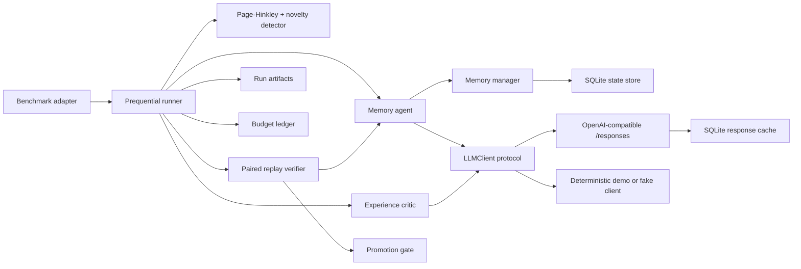
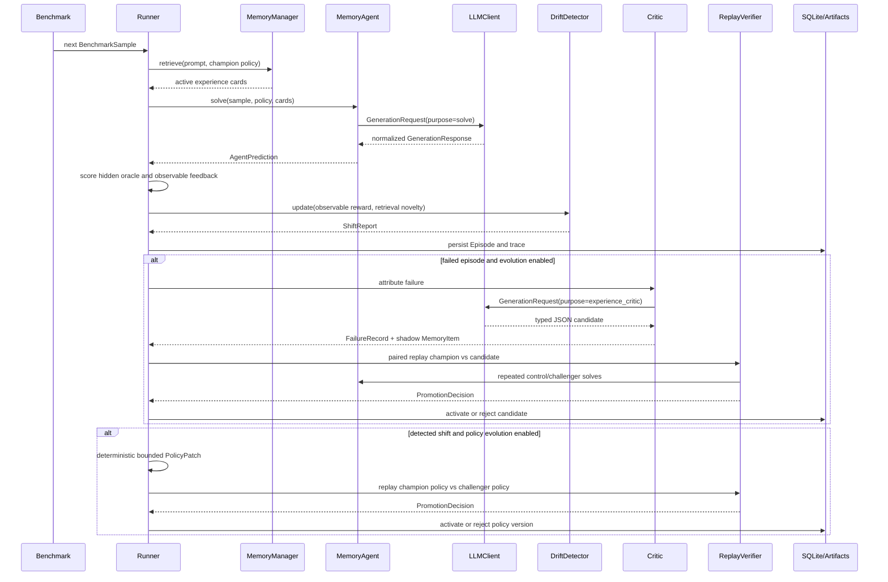
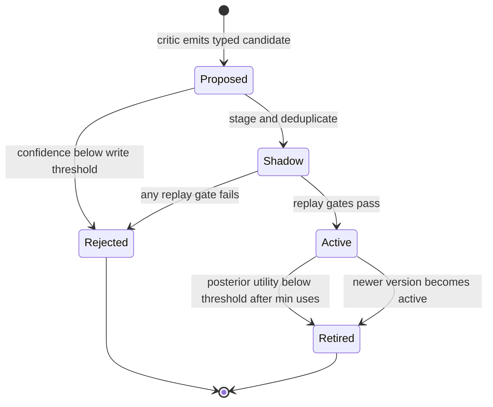
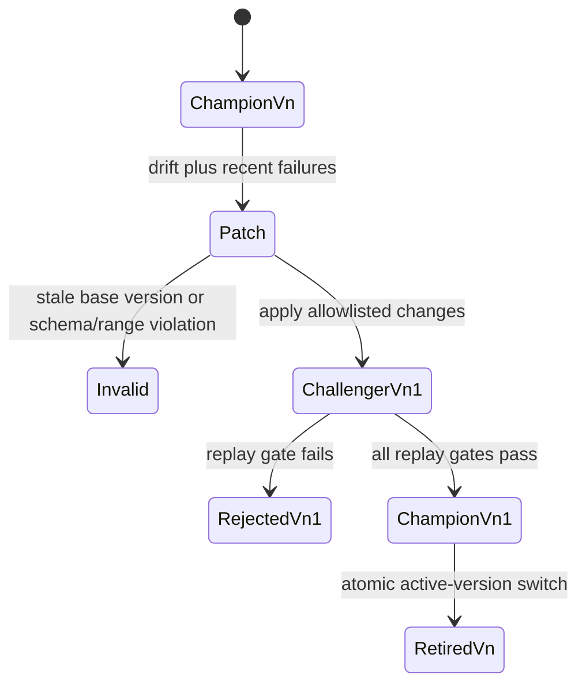

# EvoShift architecture

EvoShift is an API-only agent runtime for studying test-time adaptation under a
non-stationary task stream. Its unit of evolution is external, typed state:
procedural experience cards and a bounded retrieval policy. The project never
fine-tunes model weights and never executes model-generated code.

The architecture separates three concerns that are often mixed together in a
demo Agent:

- the data plane answers the current task;
- the adaptation plane turns feedback into candidate state and verifies it;
- the audit plane records enough evidence to reproduce or reject a claim.

The current implementation is an MVP research framework, not a multi-tenant
serving system. In particular, its Python BM25 retriever and SQLite stores are
chosen for determinism and inspectability rather than very large-scale recall.

## System boundary



Inputs are normalized `BenchmarkSample` objects. Outputs are `Episode` records,
versioned memories and policies, validation decisions, metrics, and an
experiment artifact directory. Provider credentials, network retries, and
cache behavior remain behind `LLMClient`.

## Component responsibilities

| Component | Owns | Deliberately does not own |
| --- | --- | --- |
| `BenchmarkAdapter` | Sample normalization, phase order, oracle/feedback labels, dataset fingerprint | Agent prompts or evolution |
| `EvoShiftRunner` | Predict-evaluate-evolve ordering and lifecycle | Provider-specific HTTP details |
| `MemoryAgent` | Retrieval, context injection, solve/self-refine calls, structured answer parsing | Memory promotion decisions |
| `MemoryManager` | Versioned memory lifecycle, deduplication, retrieval, online utility updates | LLM calls |
| `ExperienceCritic` | Typed failure attribution and procedural-memory proposal | Direct activation of its proposal |
| `PageHinkleyShiftDetector` | Online performance/novelty alarm and cooldown | Mutation generation |
| `ReplayVerifier` | Same-example champion/challenger replay and protected-buffer construction | Threshold policy |
| `PromotionGate` | Statistical, regression, and resource gates | Candidate generation |
| `ResponsesClient` | `/responses`, retry, parsing, idempotency, cache and budget integration | Benchmark semantics |
| `SQLiteStore` | Transactional audit state | Large-scale vector search |
| `RunArtifacts` | Human- and machine-readable experiment evidence | Secret storage |

This separation is important in interviews: it lets each assumption be tested
independently. A new drift detector does not require changing the provider; a
new benchmark does not require changing memory persistence; and a new provider
can be contract-tested without running an experiment.

## Prequential execution model

EvoShift uses prequential evaluation: predict first, score with the environment
second, and adapt only after observing that score. That ordering avoids letting
the current reference answer enter the first-pass response.



`Episode.score` stores hidden-oracle capability, while
`Episode.feedback_score` stores the observation used by the online learner.
They are identical for ordinary clean benchmarks and intentionally differ in
feedback-robustness experiments. The foreground `Episode.usage` covers the
user-facing solve path. The separate
budget ledger covers provider calls made by solve, critic, and replay when the
client is connected to it. This distinction prevents a report from silently
hiding adaptation overhead.

## Two time scales

The fast loop runs at episode granularity:

1. retrieve active memories;
2. answer and score;
3. update the success/failure posterior of memories credited by the solver;
4. on an eligible outcome, attribute the failure and stage a memory candidate;
5. verify, activate, or reject that candidate;
6. retire an active memory whose posterior utility remains too low after enough
   uses.

The slow loop is gated by detected distribution shift:

1. aggregate recent typed failures;
2. construct an allowlisted `PolicyPatch` against the active version;
3. materialize a schema-validated challenger policy;
4. compare champion and challenger on the same replay buffer;
5. activate the new version only if every promotion gate passes.

The distinction prevents expensive global policy search after every isolated
mistake while still allowing local experience acquisition.

## Memory state machine



`MemoryItem` stores trigger, scope, directive, anti-pattern, evidence, tags,
provenance episode IDs, confidence, validation statistics, and a Beta posterior
state. A stable content hash supplies a memory ID. Near-duplicate candidates
reuse the existing ID and increment its version. Activating a new version
retires older active versions of the same memory.

`SHADOW` is a crucial safety boundary: the candidate can be forced into a
challenger replay without appearing in normal champion retrieval.

## Policy state machine



The current genome includes `top_k`, memory context budget, BM25 parameters,
relevance/utility/exploration weights, MMR lambda, write threshold, and dedup
threshold. It also carries the safety-controlled
`allow_cross_domain_transfer` flag, which is deliberately outside the evolved
`PolicyPatch` allowlist. `PolicyPatch` rejects every field outside that explicit
allowlist. The active version must match `base_version`, preventing stale
concurrent mutations from being applied accidentally.

## Provider and runtime boundary

All agents depend on the asynchronous protocol:

```python
class LLMClient(Protocol):
    async def generate(self, request: GenerationRequest) -> GenerationResponse: ...
    async def generate_json(self, request, schema): ...
    async def aclose(self) -> None: ...
```

There are three implementations:

- `ResponsesClient` sends `POST {base_url}/responses` with Bearer auth;
- `FakeLLMClient`/`ScriptedLLMClient` provide deterministic offline unit tests;
- `HeuristicDemoClient` demonstrates the full evolution pipeline on controlled
  arithmetic shifts. Its behavior is intentionally constructed and must never
  be reported as a scientific result.

The Responses adapter accepts the native `output_text` convenience field,
Responses `output[].content[].text`, and the older
`choices[].message.content` shape. It normalizes token usage, latency, model,
response ID, and cost.

Runtime controls include:

- a stable content-derived idempotency key reused across retries;
- bounded retries for network errors and selected transient HTTP statuses;
- `Retry-After` support and exponential full jitter;
- an async concurrency semaphore;
- a canonical SQLite response cache that excludes credentials from its key;
- a reserve/reconcile `BudgetLedger` that accounts for concurrent logical
  requests before they are sent.

The cache is checked before budget reservation, so a cache hit does not consume
an additional request or dollar budget. Cached usage retains logical token
counts but has `cached=true`, zero incremental cost, and zero provider latency.

## Persistence and audit model

Two SQLite databases have different trust and lifecycle roles:

1. Experiment state (`state.sqlite3` by default inside each run) stores runs,
   episodes, memory versions, policy versions, validations, and evolution
   events. It uses WAL, foreign keys, transactions, and schema migrations.
2. The optional shared LLM cache stores normalized provider responses keyed by
   canonical request hashes. It is an optimization and can be deleted without
   destroying experiment state.

The state schema is append/version oriented:

```text
runs ──< episodes
  │
  ├──< validations
  └──< evolution_events

memory_items: (memory_id, version) primary key
policies: version primary key, parent_version lineage
```

Each run directory contains, as applicable:

```text
manifest.json
resolved_config.yaml
predictions.jsonl
traces.jsonl
failures.jsonl
promotion_decisions.jsonl
metrics.json
costs.json
summary.json
report.md
state.sqlite3
```

`manifest.json` records the configuration hash, dataset hash, configured model,
algorithm, seed, Python version, platform, Git commit, and dirty-worktree flag.
JSONL episode/failure/decision streams are flushed and `fsync`ed as they are
appended. Final summary files are written atomically where implemented. This is
auditability, not cryptographic immutability; a user with filesystem access can
still edit artifacts.

## Scaling characteristics

Let `N` be active memories, `T` their total token count, `k` retrieval depth,
`W` replay-window size, and `B` bootstrap samples.

- Current Python BM25 rebuilds document statistics per query: roughly
  `O(T + N|q|)` time and `O(T)` transient memory.
- MMR selection is approximately `O(kN)` candidate comparisons plus set
  similarity work.
- One normal episode makes one solver call; one memory validation makes up to
  `2W` solver calls with paired replay; one policy validation also makes `2W`.
- Percentile paired bootstrap is `O(BW)` time and `O(B)` stored means.
- SQLite writes are small transactions; WAL supports readers during the online
  loop, but a single process remains the intended writer.

For tens to low hundreds of memories this design favors transparency. At larger
scale, precomputed term statistics, SQLite FTS5, or a vector/sparse index should
replace per-query corpus rebuilding. That replacement should preserve the same
retriever interface and audit trace.

## Architectural limitations

- Replay is a calibration buffer, not an untouched test set. The implemented
  frozen audit measures whole-state transfer, but per-candidate future utility
  and a disjoint online promotion split remain required for stronger claims.
- The default memory retriever is lexical; paraphrase recall is limited.
- Provenance-domain gating depends on benchmark or application domain labels.
  Labels that are missing, excessively broad, or unstable reduce its value;
  cross-domain transfer must be measured as an explicit ablation.
- The drift detector observes correlated online samples even though its simple
  thresholds do not model temporal dependence explicitly.
- API models can be nondeterministic and mutable behind an alias.
- SQLite cache namespaces currently use provider kind and model, not a tenant
  identity; this is not a multi-tenant isolation boundary.
- Run artifacts contain benchmark prompts and answers and are not encrypted at
  rest.
- The framework records structured rationale summaries, not hidden
  chain-of-thought, so some attribution errors remain unobservable.

These are design constraints to measure and improve, not details to hide in an
interview.
