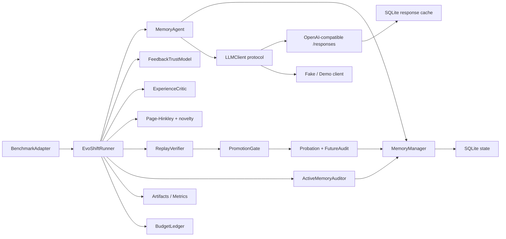
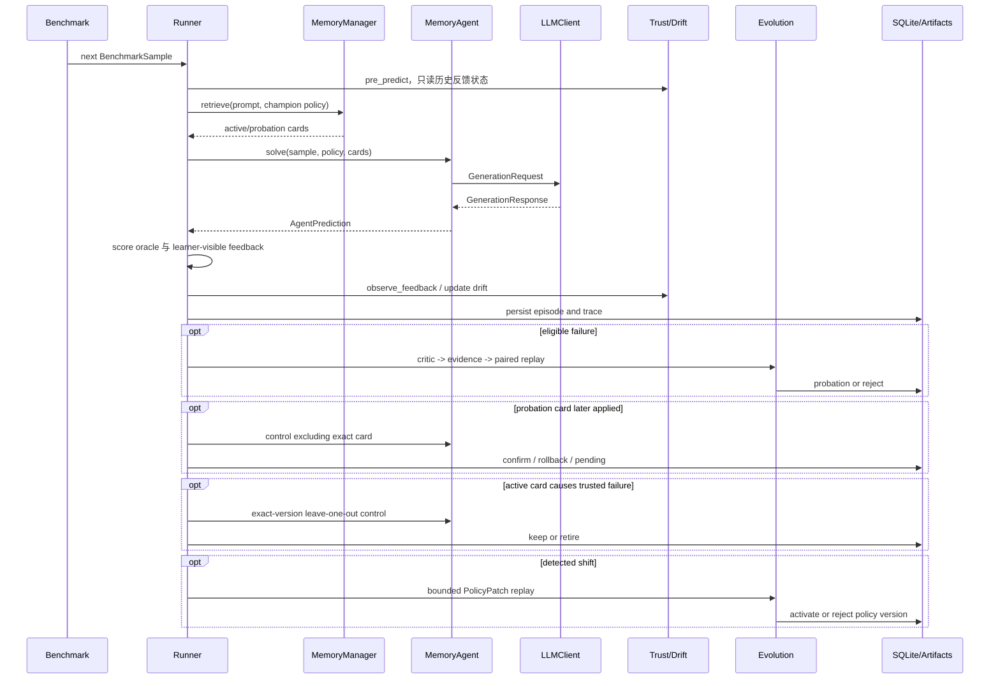
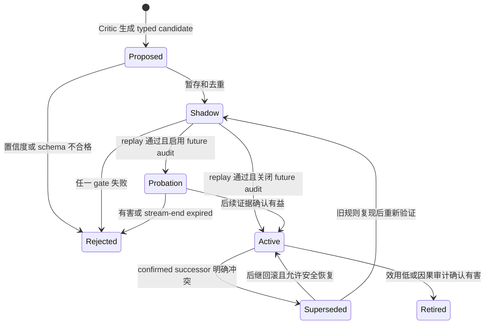
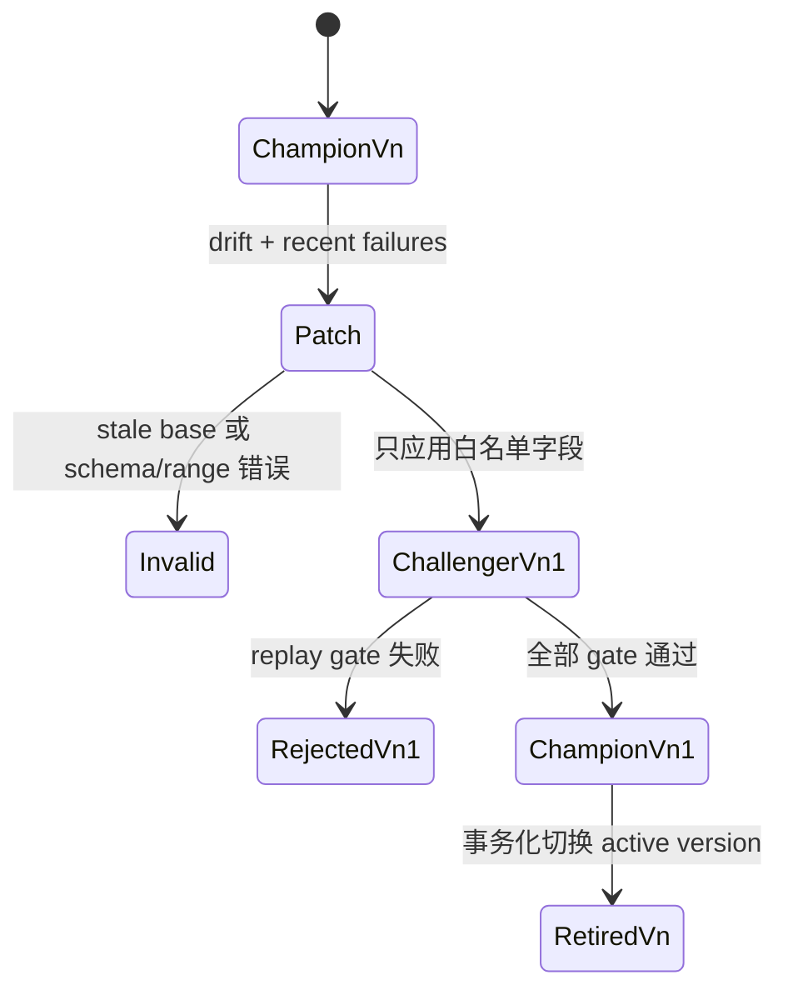

# EvoShift 架构

英文原文：[architecture.md](architecture.md)

EvoShift 是研究非平稳任务流中测试时适应的 API-only Agent runtime。它不微调模型，也不执行模型生成的代码；演化单元是外部、结构化、版本化的程序性记忆和受限检索策略。

架构将三个常被 Demo 混在一起的职责分开：

- **数据平面**：回答当前任务；
- **适应平面**：把反馈转成候选状态并验证；
- **审计平面**：保存足以复现或否定结论的证据。

当前实现是单机研究框架，不是多租户生产服务。Python BM25 和 SQLite 优先保证确定性与可检查性，而非大规模吞吐。

## 系统边界



输入统一为 `BenchmarkSample`；输出包括 `Episode`、版本化 memory/policy、validation decision、metrics 和完整实验目录。凭据、网络重试和缓存都封装在 `LLMClient` 后面。

## 组件职责

| 组件 | 负责 | 明确不负责 |
| --- | --- | --- |
| `BenchmarkAdapter` | 样本规范化、phase 顺序、oracle/feedback、数据指纹 | Agent prompt 和演化逻辑 |
| `EvoShiftRunner` | predict-score-evolve 顺序和全部生命周期编排 | provider HTTP 细节 |
| `MemoryAgent` | 检索上下文注入、solve/self-refine、结构化答案解析 | promotion 决策 |
| `MemoryManager` | 版本、去重、检索、效用和状态迁移 | LLM 调用 |
| `ExperienceCritic` | typed failure attribution 和候选经验 | 直接激活候选 |
| `FeedbackTrustModel` | 可观测 source/context 时序一致性和适应资格 | 隐藏 oracle 真值 |
| `PageHinkleyShiftDetector` | 性能/新颖度报警和 cooldown | 生成策略变异 |
| `CandidateEvidencePool` | signature 聚合、retry cooldown、重复抑制 | promotion 打分 |
| `ReplayVerifier` | 同题 champion/challenger replay 和 protected buffer | 决策阈值 |
| `PromotionGate` | 统计、回归和资源门 | 候选生成 |
| `FutureCounterfactualAuditor` | probation 的 memory-on/off 确认、回滚、过期 | 隐藏 oracle 在线决策 |
| `ActiveMemoryAuditor` | 精确版本 leave-one-out 和因果退休 | 无界审计或 probation 管理 |
| `ResponsesClient` | `/responses`、重试、解析、幂等、缓存和预算 | benchmark 语义 |
| `SQLiteStore` | 事务化审计状态 | 大规模向量检索 |
| `RunArtifacts` | 人类和机器可读证据 | secret storage |

这种边界使各假设可独立替换：换 drift detector 不必改 provider，换 benchmark 不必改 memory persistence。

## Prequential 执行模型

EvoShift 强制先预测、再评分、最后适应，避免当前 reference 泄漏到首答。



`Episode.score` 保存隐藏 oracle 能力，`Episode.feedback_score` 保存在线学习器可见观测。普通干净基准二者相同；反馈鲁棒性实验中故意分离。前台 `Episode.usage` 只计算用户解题路径，BudgetLedger 则覆盖 solve、critic 和 replay 的全部外部调用。

## 两个时间尺度

快环每个 episode 都可能运行：检索、作答、评估信任、更新效用、归因失败、聚合候选、shadow replay、probation、future audit、冲突替代和 active retirement。

慢环只有漂移报警才运行：汇总近期 typed failures，构造白名单 `PolicyPatch`，schema 校验 challenger，在同一 replay buffer 上比较，全部门通过才切换 active policy。

如果快环已经在本轮提升了局部记忆，默认抑制慢环，避免对一个已解决问题重复执行昂贵的全局策略搜索。

## 记忆状态机



`MemoryItem` 保存 trigger、scope、directive、anti-pattern、evidence、tags、provenance episode IDs、confidence、validation stats 和 Beta posterior。内容 hash 形成稳定 ID；近重复候选复用 ID 并增加 version。

`SHADOW` 是关键安全边界：只能被强制加入 challenger，不能进入正常检索。`PROBATION` 可以有限参与真实回答，以产生 memory-on 处理组；control 只排除该精确卡片。只有 Future Audit 确认后，冲突 predecessor 才被 supersede。

同一个逻辑 `memory_id` 同时最多有一个 pending future audit。审计按精确 `(memory_id, version)` 完成，而不是读取 latest row。

## 策略状态机



Genome 包含 `top_k`、上下文预算、BM25 参数、relevance/utility/exploration 权重、MMR lambda、write threshold 和 dedup threshold。安全敏感的 `allow_cross_domain_transfer` 不在自动演化白名单中。Patch 必须声明当前 `base_version`，防止 stale 并发变异被应用。

## Provider 与 Runtime 边界

所有 Agent 依赖异步协议：

```python
class LLMClient(Protocol):
    async def generate(self, request: GenerationRequest) -> GenerationResponse: ...
    async def generate_json(self, request, schema): ...
    async def aclose(self) -> None: ...
```

实现包括：

- `ResponsesClient`：调用 `POST {base_url}/responses`；
- `FakeLLMClient` / `ScriptedLLMClient`：确定性单测；
- `HeuristicDemoClient`：控制算术漂移的管线演示，不能当科研结果。

Responses adapter 兼容 native `output_text`、`output[].content[].text` 和旧式 `choices[].message.content`，统一 usage、latency、model、response ID 和 cost。

Runtime 控制包括稳定内容派生幂等键、选定网络/HTTP 错误的有界重试、`Retry-After`、指数 full jitter、并发 semaphore、无凭据 canonical cache key，以及并发请求前 reserve、完成后 reconcile 的 BudgetLedger。Cache hit 在预算预留前返回，因此无增量调用、成本和 provider latency。

## 持久化与审计

两个 SQLite 库职责不同：

1. 每次 run 的 `state.sqlite3` 保存 episode、memory/policy version、validation 和 evolution event；
2. 可选共享 LLM cache 只保存规范化 response，可删除而不破坏实验状态。

状态 schema 以 append/version 为中心：

```text
runs ──< episodes
  │
  ├──< validations
  └──< evolution_events

memory_items: (memory_id, version) primary key
policies: version primary key, parent_version lineage
```

运行目录通常包含：

```text
manifest.json
resolved_config.yaml
predictions.jsonl
traces.jsonl
failures.jsonl
promotion_decisions.jsonl
metrics.json
costs.json
summary.json
report.md
state.sqlite3
```

Manifest 记录 config/dataset hash、model、algorithm、seed、Python、platform、Git commit 和 dirty flag。JSONL 增量 flush + `fsync`，最终摘要原子写入。它提供可审计性，不是密码学不可篡改：有文件系统权限的人仍可编辑 artifact。

## 扩展性

设 active memory 数 `N`、总 token `T`、retrieval depth `k`、replay window `W`、bootstrap 次数 `B`：

- 当前 Python BM25 每次查询重建统计，约 `O(T + N|q|)` 时间和 `O(T)` 临时内存；
- MMR 约 `O(kN)` 次候选比较；
- 普通 episode 1 次 solve，memory/policy verification 最多各 `2W` 次 solve；
- paired bootstrap 为 `O(BW)`；
- SQLite 适合单 writer、小事务和 WAL reader。

几十到数百张记忆时，该设计强调透明度。更大规模应换成预计算 term stats、SQLite FTS5 或 sparse/vector index，同时保持 retriever contract 和审计 trace。

## 架构限制

- Replay 是 calibration buffer，不是 untouched test；
- 默认 lexical retrieval 对 paraphrase 召回有限；
- provenance-domain gate 依赖稳定、有意义的 domain metadata；
- 简单漂移阈值没有显式建模时间相关性；
- API alias 可能非确定且会被 provider 更新；
- cache namespace 不是 tenant security boundary；
- artifact 包含 prompt/answer 且未静态加密；
- 系统只保存结构化 rationale summary，不保存隐藏 chain-of-thought。

这些是需要测量和改进的约束，不应在面试中回避。
