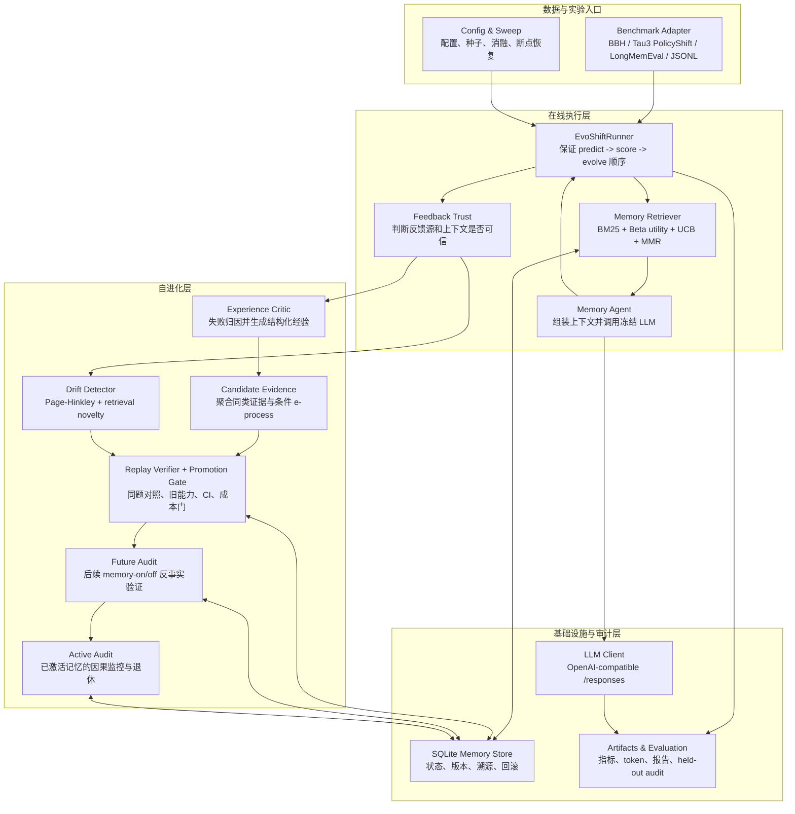
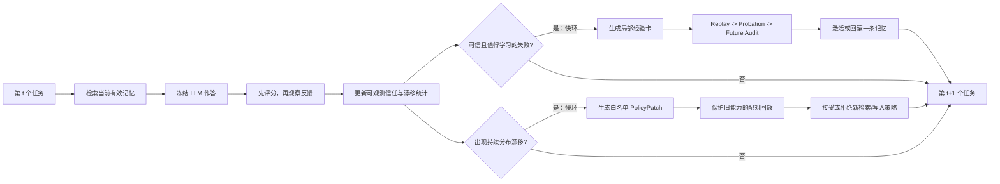
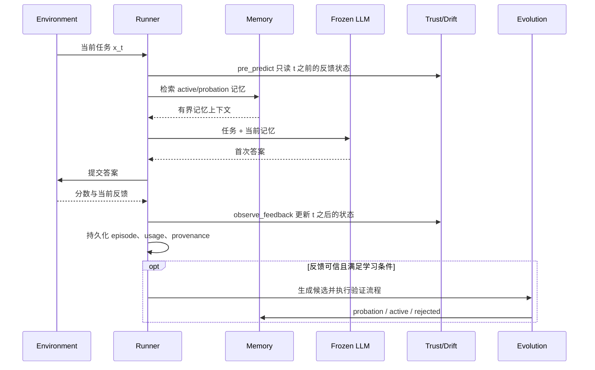
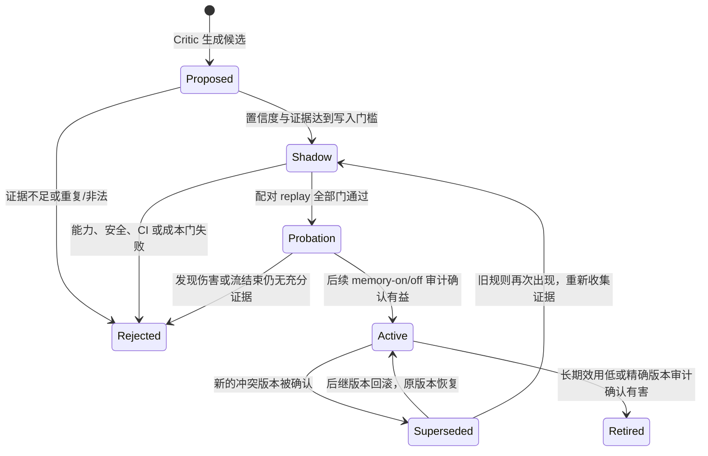

# EvoShift 模块与工作流

这篇文档回答三个问题：项目由哪些模块组成，快环和慢环分别做什么，一条经验如何从候选变成可用记忆。

## 1. 系统模块

各模块的职责可以压缩为四层：

| 层 | 已实现模块 | 主要输出 |
| --- | --- | --- |
| 数据层 | BBH、Tau3 retail policy drift、LongMemEval_S、Hugging Face、JSONL、合成流 | 统一的按时间排序任务流和数据指纹 |
| 推理层 | Memory Retriever、Memory Agent、OpenAI-compatible Client | 答案、使用过的记忆、token/延迟 |
| 演化层 | Feedback Trust、Drift Detector、Critic、Candidate Evidence、Replay、Future/Active Audit | 候选记忆、验证决定、策略补丁、回滚决定 |
| 实验层 | SQLite、不可变 artifacts、可恢复 sweep、基线/消融、冻结 held-out audit | 可复现实验和完整证据链 |

## 2. 什么是快环和慢环

这里的“环”就是反馈闭环：Agent 作答后观察结果，再决定是否改变下一轮的状态。两者都**不修改模型参数**。

### 快环：学习一条局部经验

快环按 episode 运行，解决“这类具体问题以后应该怎么做”。例如政策从“允许无票退款”变为“必须有购买凭证”，快环会尝试形成一张有适用范围的操作记忆。

它依次执行：

1. 判断失败反馈是否达到学习门槛；
2. Critic 生成带 trigger、scope、directive、anti-pattern 和 provenance 的经验卡；
3. 同类候选先聚合证据，避免一次反馈直接写入；
4. 在影子区做 champion/challenger 配对 replay；
5. 通过后进入 probation，在后续真实任务中进行 memory-on/off 对照；
6. 确认有益才变为 active，有害或证据不足则拒绝、回滚或过期。

快环改变的是**局部程序性记忆**，通常只影响一个 domain/context，适应速度较快。

### 慢环：调整全局学习与检索策略

慢环只在 Page-Hinkley 检测到持续性能下降或检索新颖度升高时触发，解决“当前记忆系统的工作方式是否已经不适合新分布”。

它不会让 LLM 任意重写代码，而是生成白名单 `PolicyPatch`，只允许调整有范围限制的参数，例如：

- 检索相关性、效用、探索项的权重；
- `top_k`、MMR 多样性和上下文预算；
- 写入、回放或提升门槛。

新策略必须和旧策略在同一 replay buffer 上对比，并同时通过当前规则、受保护旧规则、统计置信度和资源成本门。失败就保留旧策略。

### 两个环如何配合

- 单个、局部、可归因的失败优先由快环写经验解决；
- 连续多个任务都变难、检索普遍失配时，慢环才考虑调整全局策略；
- 如果本轮快环已经成功提升记忆，慢环不会重复发起昂贵的全局搜索；
- 两个环最终都走验证门和版本化存储，因此任何改变都可拒绝、审计和回滚。

## 3. 单个 episode 的严格时序

这个顺序是项目的 oracle firewall：当前 episode 的 reference、正确答案、policy version、攻击标记等隐藏字段可以用于事后计算指标，但不能帮助当前首答，也不能伪装成在线算法的输入。

## 4. 一条记忆的生命周期

几个关键状态：

- **Shadow**：候选只能参加挑战者回放，正常回答检索不到它；
- **Probation**：有限试用，可以被检索，但尚未永久替换冲突旧记忆；
- **Active**：通过后续反事实审计的正式记忆；
- **Superseded/Retired**：保留版本和证据，不等于物理删除；旧规则复现时仍需重新验证，不能直接复活。

## 5. 检索内部做了什么

一次检索不是简单的向量相似度排序：

其中 UCB 是多臂老虎机思想中的探索奖励，但实现并不是完整的 bandit 决策器：最终分数由文本相关性、记忆效用和探索项共同组成，再经 MMR 控制重复信息。LongMemEval 还提供可选的 BM25/LLM 排名融合；LLM 输出非法时精确回退 BM25。

## 6. 最简理解

可以把 EvoShift 看成一个带代码审查流程的 Agent 记忆系统：

- Critic 提交“经验修改”；
- Shadow replay 相当于单元测试；
- protected replay 相当于回归测试；
- Probation 相当于灰度发布；
- Future Audit 相当于线上 A/B 对照；
- versioning、rollback 和 artifacts 相当于版本控制与审计日志；
- 快环修改一条局部经验，慢环修改受限的全局检索/写入策略。

因此项目的核心不是“让 LLM 多反思一次”，而是建立一套**反馈是否可信、经验是否有效、旧能力是否退化、改变是否应该回滚**的可验证自进化流程。
